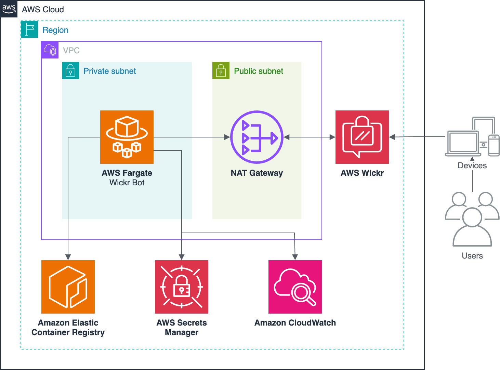

# Wickr Bedrock Bot

A Wickr bot integration with Amazon Bedrock that enables interaction with Bedrock's foundation models through Wickr. This sample demonstrates how to use TypeScript for Wickr bot development and deploy serverlessly with AWS CDK. 

## Prerequisites

- Node.js 20 or later
- AWS CDK CLI
- Docker
- AWS Account with appropriate permissions

## Project Structure

```
.
├── bin/                   # CDK app entry point
├── bot/                   # Bot implementation
│   ├── src/               # Bot source code
│   ├── scripts/           # Bot runtime scripts
│   ├── types/             # Type definitions for Wickr bot module
│   └── Dockerfile         # Bot container definition
├── lib/                   # CDK infrastructure code
└── test/                  # CDK tests
```

## Configuration

1. Copy the example configuration file:
```bash
cp config.example.yaml config.yaml
```

2. Update the configuration in `config.yaml`:
```yaml
# The AWS account ID where resources will be deployed
account: "xxxxxxxxxxxx"
# The AWS region where resources will be deployed
region: "us-east-1"
# Flag to indicate if this is a development environment
isDevelopmentEnv: true
# (optional) ID of an existing VPC to use for ECS Fargate
# delete this if you want a new VPC to be created automatically
vpcId: 'xxxxxxxxxxxxxxxxxxxxx'
# The ARN of the AWS Secrets Manager Secret containing the bot username and password
credentialsArn: 'xxxxxxxxxxxxxxxxxxxxx'
```

## AWS Wickr Setup

Before deploying, you must set up AWS Wickr and create the necessary users. Follow these steps:

1. Create a Wickr Network (skip if using existing network):
   - Open the AWS Management Console and navigate to AWS Wickr
   - Choose "Create a network" 
   - Enter a network name and select your plan
   - Complete the network creation process

2. Create a Regular User:
   - In the AWS Wickr Networks page, select "Admin" for your network
   - Navigate to User > Team Directory
   - Choose "New User"
   - Enter the required information (email address is mandatory)
   - Create the user and note that they will receive an invitation email

3. Create a Bot User:
   - Navigate to User > Bot Management
   - Choose "Create New Bot"
   - Enter the required information
      - NOTE: Username must be lowercase, cannot contain any spaces or special characters other than `-`, and must end with "bot" (e.g. `bedrock-bot`)
   - Make note of the username and password - you'll need these for the next step

4. Store Bot Credentials:
   - Navigate to AWS Secrets Manager in the console
   - Choose "Store a new secret"
   - Select "Other type of secret"
   - Create a secret with the following key-value pairs:
     ```json
     {
       "username": "your-bot-username",
       "password": "your-bot-password"
     }
     ```
   - Give the secret a name and description
   - Complete the secret creation process
   - Copy the secret's ARN

5. Configure Settings:
   - Open the `config.yaml` file in the root directory of this repo
   - Paste the secret ARN into the `credentialsArn` field

The Wickr bot setup depends on these resources being properly configured before deployment. If you deploy without completing these steps, the bot container won't initialize successfully.

## Infrastructure

The project uses AWS CDK to define and deploy the following infrastructure:

- VPC (new or existing)
- ECS Cluster
- Fargate Service running the bot container
- IAM roles and policies
- CloudWatch log groups



## Deployment

The bot is deployed as a container to AWS ECS Fargate. The deployment process:

1. Builds the Docker image
2. Pushes it to ECR
3. Updates the ECS service
4. Bot container (ECS Task) gets credentials from Secrets Manager
5. Bot container installs and starts `bedrock-bot` integration

To deploy changes:
```bash
npx run cdk deploy --all
```

## Cleanup
To clean up the environment and delete all provisioned infrastructure, run:
```bash
npx run cdk destroy --all --require-approval never
```

## Security

See [CONTRIBUTING](CONTRIBUTING.md#security-issue-notifications) for more information.

## License

This library is licensed under the MIT-0 License. See the LICENSE file.